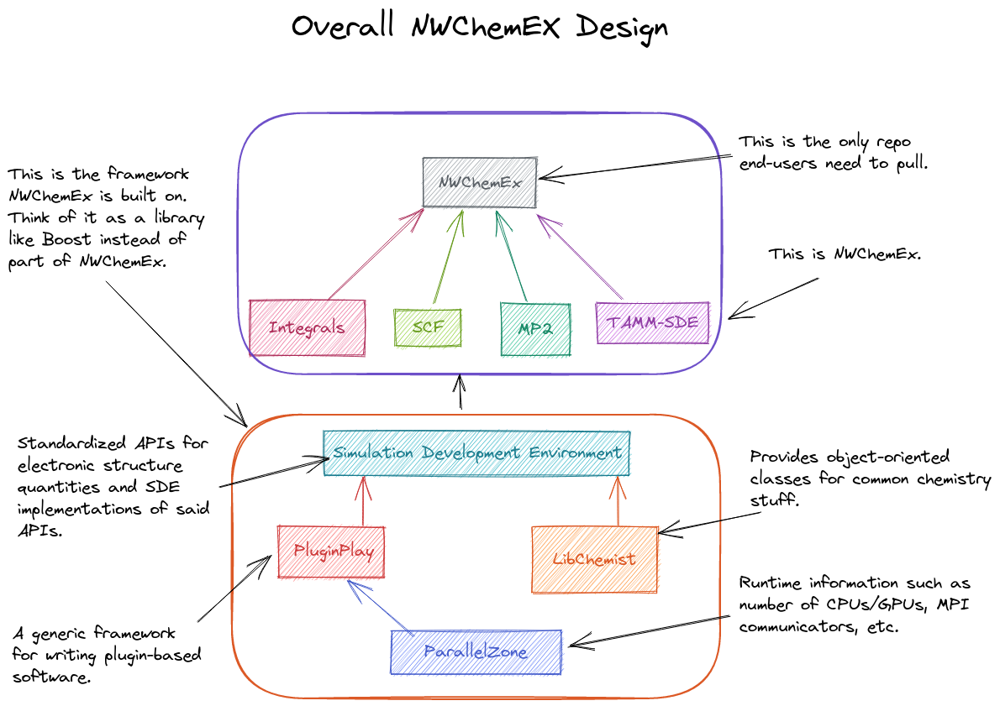

**************
Overall Design
**************

The point of this page is to explain the philosophy and organization of
NWChemEx's software stack.

.. _software_stack_overview:

Software Stack Overview
=======================

The NWChemEx Project is made up of two major software components: the framework
known as the simulation development environment, or SimDE for short, and the
NWChemEx electronic structure package.

   Diagram of the overall NWChemEx Design

SimDE
=====

SimDE encapsulates the infrastructure required to:
- interact with the hardware,
- manage and run modules,
- and describe commonly occurring computational chemistry concepts.
SimDE is intended to have APIs that are long-term stable. Most
developers will only interact with SimDE and will not need to perform
development on it.

Conceptually you can think of SimDE as being akin to a typical smartphone
operating system, but targeting computational chemistry. Like a smartphone OS,
SimDE manages a bunch of apps (which we call modules), takes care of inter-app
communication (passing data among the modules), and automates more mundane tasks
(like logging and saving results). SimDE is extensible in that new modules and
communication protocals can be added downstream from it, even at runtime.

This generality and flexibility comes at the cost of complexity. While design
efforts have striven to make SimDE as simple as possible, the reality is that it
is still quite verbose from a typical electronic structure user's perspective.
It is the responsibility of whatever sits on top of SimDE to provide more
user-friendly APIs. More complicated workflows can always directly access SimDE
for finer-grained control.

The main components of SimDE are summarized in the following table:

============== =====================================================
Repository     Description
============== =====================================================
ParallelZone   The runtime abstraction layer
PluginPlay     SimDE for working with plugins
LibChemist     Chemistry specific classes, used to define APIs
SimDE          Definitions of APIs, top-level repo for SimDE
============== =====================================================

NWChemEx
========

The NWChemEx electronic structure theory package is itself made up of two main
components: a series of modules for use with SimDE and a user-friendly API for
running those modules. If we continue the smartphone analogy, the modules
provided by NWChemEx are first-party apps (for Android users think GMail, Google
Calendar, Chrome, *etc.*; iPhone users think Mail, iCal, Safari, *etc.*). SimDE
doesn't limit you to the modules which come from NWChemEx and developers are
free to write their own modules and use them with SimDE. From the perspective of
SimDE, where a module comes from doesn't matter, *i.e.*, modules that are part
of NWChemEx are treated no differently than modules that are not part of
NWChemEx.

Finally in the smartphone analogy, the user-friendly API of NWChemEx is similar
to the graphical user interface your phone provides. When you click on a street
address in an email app and it brings up the location in your map app, you don't
really think about how the apps communicated or what library calls were needed
to make that happen. Similarly, when you tell NWChemEx to compute the energy of
a molecule, through the user-friendly API, you don't have to think about how
that request gets dispatched through the modules and libraries underlying
NWChemEx.

The main components of NWChemEx are summarized in the following table:

============== =======================================================
Repository     Description
============== =======================================================
Integrals      Modules for computing integrals with AOs
SCF            Modules related to Hartree-Fock and DFT
MP2            Modules realted to Moller-Plesset perturbation theory
TAMM-SDE       An assortment of modules which use TAMM instead of TA
NWChemEx       The top-level repo which provides the user-friendly API
============== =======================================================

Miscellaneous Repositories
==========================

The NWChemEx-Project organization contains a number of additional "meta"
repositories that are not directly required for building NWChemEx. They are
summarized in the following table.

============== ==========================================================
Repository     Description
============== ==========================================================
DeveloperTools Developer documentation and tools for maintaining NWChemEx
Publications   Manuscripts written by the NWChemEx team about NWChemEx
============== ==========================================================
