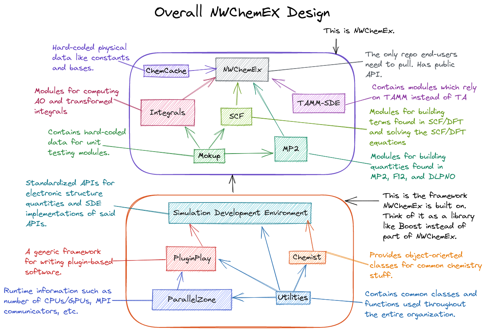

**************
Overall Design
**************

The point of this page is to explain the philosophy and organization of
NWChemEx's software stack.

.. _software_stack_overview:

Software Stack Overview
=======================

The NWChemEx Project is made up of two major software components: the framework
and the NWChemEx electronic structure package.

   Diagram of the overall NWChemEx Design

The Framework
=============

The framework component encapsulates the infrastructure required to:
- interact with the hardware,
- manage and run modules,
- and describe commonly occurring computational chemistry concepts.
The framework is intended to have APIs that are long-term stable. Most
developers will only interact with the framework and will not need to perform
development on it.

Conceptually you can think of the framework layer as being akin to a typical
smartphone operating system. Like a smartphone OS, the framework manages a bunch
of apps (which we call modules), takes care of inter-app communication (passing
data among the modules), and automates more mundane tasks (like logging and
saving). The framework layer is quite general and quite flexible. In particular
the framework does not need to know about a module ahead of time and modules can
be added at runtime.

This generality and flexibility comes at the cost of complexity. While design
efforts have striven to make the framework layer as simple as possible, the
reality is that it is still quite verbose from a typical electronic structure
user's perspective. It is the responsibility of whatever sits on top of the
framework to provide more user-friendly API. More complicated workflows can
always directly access the framework for finer-grained control.

The main components of the framework are summarized in the following table:

============== ===================================================
Repository     Description
============== ===================================================
ParallelZone   The runtime abstraction layer
SDE            The runtime framework
LibChemist     Chemistry specific classes
PropertyTypes  Definitions of the module APIs
============== ===================================================

NWChemEx
========

The NWChemEx electronic structure theory package is itself made up of two main
components: a series of modules for use with the framework and a user-friendly
API for running those modules. If we continue the smartphone analogy the modules
provided by NWChemEx are first-party apps (for Android users think GMail, Google
Calendar, Chrome, etc; iPhone users think Mail, iCal, Safari, etc.). From the
perspective of the framework where a module comes from doesn't matter, *i.e.*,
modules that are part of NWChemEx are treated no differently than modules that
are not part of NWChemEx. In the smartphone analogy the user-friendly API is
similar to the graphical user interface your phone provides. When you click on
an address in an email app and it brings up a map in your map app, you don't
really think about how the apps communicated and what library calls were needed
to make that happen. Similarly, when you tell NWChemEx to compute the energy of
a molecule through the user-friendly API you don't have to think about how that
request gets dispatched through the modules and libraries underlying NWChemEx.

Miscellaneous Repositories
==========================

The NWChemEx-Project organization contains a number of additional "meta"
repositories that are not directly required for building NWChemEx. They are
summarized in the following table.

============== ==========================================================
Repository     Description
============== ==========================================================
DeveloperTools Developer documentation and tools for maintaining NWChemEx
Publications   Manuscripts written by the NWChemEx team about NWChemEx
dox            Deprecated documentation repo
============== ==========================================================
