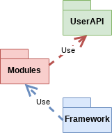
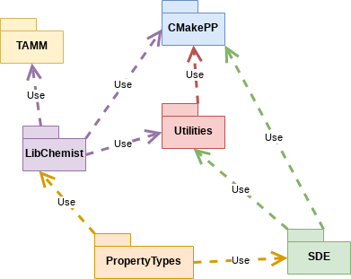
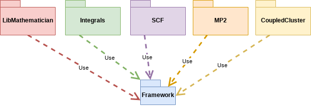

**************
Software Stack
**************

The point of this page is to explain the philosophy and organization of
NWChemEx's software stack.

Software Stack Overview
=======================

NWChemEx is made up of three major software components. In order from least user
facing to most user facing they are: the framework, the modules, and the user
API. This is summarized in the following figure:

   UML diagram of the four major components of the NWChemEx software stack.

The framework component encapsulates the infrastructure required to interact
with the hardware and to run the modules. The framework is intended to have APIs
that are long-term stable. Most developers will only interact with the framework
through its API and will not need to perform development on it. In addition to
the literal infrastructure needed to drive the program, the framework layer also
includes the classes used to abstract basic chemistry concepts. This is where
you will find the definition and implementation of concepts such as tensors,
molecules, and atomic orbital basis sets.

The module layer is where most of the infrastructure commonly associated with an
electronic structure package resides. This is where you will find code for
running an SCF, optimizing a geometry, or evaluating electronic integrals. Each
module is a self-contained code that performs a single task. Packages outside
the NWChemEx ecosystem that are interested in leveraging our functionality do
so through modules. It is essential that modules remain decoupled from as much
as possible to facilitate their uptake by other packages. This is accomplished
by only depending on the framework layer and not other modules.

The framework layer is quite general and quite flexible. This generality and
flexibility comes at the cost of complexity. While design efforts have striven
to make the framework layer as simple as possible, the reality is that it is
still quite verbose from a typical user's perspective. Consequentially, the
user API layer wraps the set-up of the framework (including setting up modules)
in a more user-friendly API. This API is built on top of the full framework API
and is designed to make simple tasks easy. More complicated workflows can always
directly access the framework for finer-grained control.

The following sections provide more detailed overviews of each software
component.

Framework Layer
===============

   Components comprising the framework layer of NWChemEx.

The framework layer contains software components used to assemble the software
infrastructure of NWChemEx. At the base of this layer is
`CMakePP <https://github.com/CMakePP>`_. CMakePP is a CMake module designed to
facilitate building C and C++ projects. Nearly all of NWChemEx's components use
CMakePP as their build system. Historically the complexity of a C/C++ project's
build system has been a driving motivation for avoiding a modular software stack
like NWChemEx's. It is thanks to CMakePP that we are able to maintain our
modular stack.

The ``Utilities`` repo serves as NWChemEx's Boost. It contains a variety of
non-chemistry classes that augment C++'s standard library. Developers who write
generic classes that they perceive as being useful for a wide range of
applications are encouraged to submit them to the ``Utilities`` repo.

``LibChemist`` and ``TAMM`` define the classes used for data passing.
Respectively these repos focus on chemistry-related and tensor-related classes.
All common APIs are written in terms of classes that are defined in these repos
or are part of the standard C++ library.

``SDE`` is the framework proper. It is responsible for stitching the modules
together to form the program's call graph. It also is charged with logging the
computation and managing computer resources. It works in conjunction with
``PropertyTypes``. ``PropertyTypes`` defines the APIs that modules must satisfy.
A property type is akin to an abstract base class for a module. To use your
module, other modules do not need to know the inner details of your module, but
rather which property types it satisfies. This allows us to defer coupling to
runtime and have an incredibly flexible program. Modules are key concept in the
NWChemEx program explained in more detail in the next section.

Framework Repository Quick-Reference
------------------------------------

The following table provides a quick reference to what each of the framework
repositories contain.

============== ===================================================
Repository     Description
============== ===================================================
Utilities      Helpful, generic C++ classes akin to Boost/STL
TaskForce      The runtime abstraction layer
SDE            The runtime framework
TAMM           A C++ tensor library designed for quantum chemistry
LibChemist     Chemistry specific classes
PropertyTypes  Definitions of the module APIs
============== ===================================================

Module Layer
============

   Module layer of NWChemEx

You can think of the framework as being similar to your phone's operating system
and modules as being similar to apps. The module layer is then analogous to the
app store on your phone. Namely it is comprised of all the possible modules that
can be used with the framework layer. Each module satisfies one or more property
types. Roughly speaking saying a module satisfies property type ``X`` is
analogous to saying an app is an email client versus a game. That app can then
be used whenever you need to send/receive an email. Analogously, a module that
satisfies say property type ``Energy`` can be used anytime you need to compute
an energy.  Obviously there are many ways to compute the energy of a molecular
system. Each module is responsible for implementing one of them and the
framework is responsible for choosing the implementation the user wants.

While each module is capable of being used independently it tends to be the
case that modules are developed in close connection with other modules. For
example, the module for computing the energy of a molecular system using the
SCF level of theory, is developed in close connection with the module for
building the Coulomb matrix. For this reason NWChemEx groups the modules into
repos. As shown in the accompanying UML diagram, note that there are no
cross-dependencies, rather each repo depends only on the framework layer (in
truth some of the repos also have external dependencies that are not shown
here, but the point remains that there is no additional coupling to NWChemEx).

Module Repository Quick-Reference
---------------------------------

The following table provides a quick-reference for what sorts of modules
are in each repo.

================ ========================================================
Repository       Description
================ ========================================================
LibMathematician Encapsulate linear algebra routines like diagonalization
Integrals        Modules implementing AO-based integrals
SCF              Modules implementing self-consistent field theory
MP2              Modules implementing MP2 (and variations of it)
CoupledCluster   Modules implementing coupled cluster theory
================ ========================================================

User API Layer
==============

Ultimately when a user starts up NWChemEx it spins up the framework and loads it
with modules. The responsibility for selecting NWChemEx's default modules and
default options falls to the user API layer. The user API is contained within
the ``NWChemEx`` repo. This repo is capable of automatically building all of
the dependencies contained in the framework and module layers. The ``NWChemEx``
repo also contains miscellaneous Python functions to provide a cleaner, more
user-friendly API to NWChemEx. These functions are built on top of the
framework's API and can be intermixed with raw calls to the framework. Hence it
is possible to fully control NWChemEx in conjunction with the user API.

Miscellaneous Repositories
==========================

The NWChemEx-Project organization contains a number of additional "meta"
repositories that are not directly required for building NWChemEx. They are
summarized in the following table.

============== ==========================================================
Repository     Description
============== ==========================================================
DeveloperTools Developer documentation and tools for maintaining NWChemEx
Publications   Manuscripts written by the NWChemEx team about NWChemEx
dox            Deprecated documentation repo
============== ==========================================================

FAQs
====

Why So Many Repos?
------------------

When transitioning from developing a more traditional electronic structure
package to NWChemEx, one of the first observations developers make is that there
are a lot of repos. The motivation behind this is to decouple the source code
into individual components. Each of these components is capable of being used on
its own without the rest of NWChemEx. It is our hope that such a code
factorization will facilitate adoption of these components by other codes,
thereby motivating code reuse.

While lots of electronic structure packages are comprised of libraries, and
therefore tout that they are modular, it has been our experience that few
actually are modular. The main reason they are not modular is that the libraries
are tightly coupled. Specifically it is in general not possible to use one of
the libraries without pulling in the entirety of the package. NWChemEx's
strategy of keeping each library in an individual repo forces each library to be
stand alone. It also makes it easier for other codes to get the library they
want without having to extract it from a monolithic code base.

So Where's "NWChemEx"?
----------------------

Having a bunch of individual repos is great for developers, but confusing to
users. Users only need to build the ``NWChemEx`` repo. Building this repo will
build all dependencies which are required to have the complete NWChemEx
electronic structure package.

