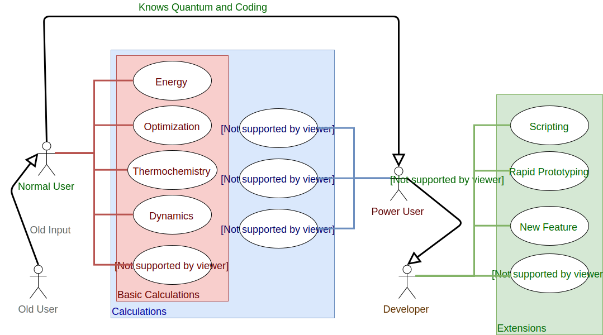
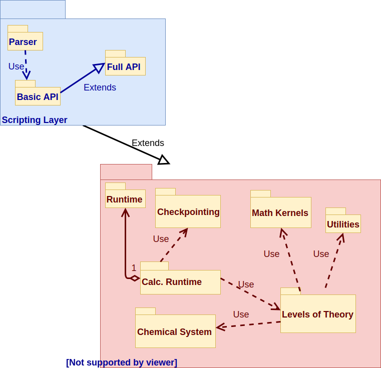
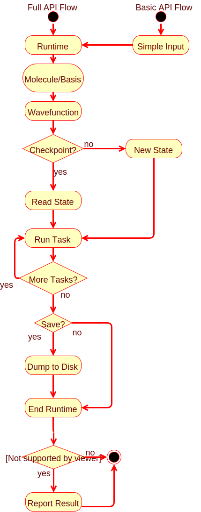

How the Code is Structured
==========================

The point of this page is to provide context on various aspects of NWChemEx's
code structure.

Contents
--------
1. [Interactions With Users](#interactions-with-users)
2. [NWChemEx SDK](#nwchemex-sdk)

Interactions With Users
----------------------- 

At the very top-level NWChemEx is targeted at four types of users:
 
1. Normal users
   - Goal: run "normal" computations 
   - Okay switching to new input syntax
2. Old users
   - Goal: run "normal" computations
   - Use old NWChem syntax
3. Power users
   - Run non-standard computations
   - Non-invasively extend functionality
4. Developers
   - Extend the functionality of NWChemEx
The following use case diagram is meant to provide more details pertaining to
the typical use cases one can expect.       

It is reasonable to anticipate that the main consumers of NWChemEx are going 
to be users who want to run "normal calculations".  For our purposes a normal
calculation is one of the following:

- Single-point energy computation
- Geometry optimization
- Thermochemistry calculation 
  - IR/Raman frequencies and intensities
  - ZPE, Enthalpy, Entropy, Free Energy
- Wavefunction property
  - Electrostatic potential
  - Charge analysis
  - Molecular orbitals
- Dynamics     

Ideally one would like to be able to perform all of these calculations on an 
arbitrary level of theory, even if that means finite difference computations 
for higher-order derivatives.  Being an NWChem product we especially want the
above to work and perform well in highly-parallel environments.  

Additionally we anticipate power users wanting
direct access to non-standard information (Fock matrix, integrals, the actual
gradient/Hessian, *etc.*), the ability to control every aspect of the 
computation, and the ability to extend a computation (say take a previously 
computed SCF computation and then use it to run an MP2 calculation).

Finally, we want NWChemEx to be a viable platform for further scientific 
discovery.  This has several aspects:
- Program flow is easily scriptable
- New features can be added with minimal influence on the rest of the code
- Rapid prototyping is facilitated by highly-tuned reusable components
- Adding features (or anything really) "Just Works"

NWChemEx SDK
------------

The primary goal of NWChemEx is to provide a platform that performs quantum 
chemistry at scale on modern high-performance machines.  None the less it is 
also our intent to have NWChemEx be user friendly and to excel at performing 
quantum chemical research including methods development.  To this end we 
purpose the NWChemEx SDK (software development kit) which is comprised of two
 major components:
- Scripting layer
  - Runtime aspect
    - User-friendly API to run basic quantum chemistry
  - SDK aspect
    - Rapid prototyping
    - Access to non-standard details
    - Integration into other packages supporting the scripting language
- C++ core: NWChemEx
  - Implementations of all functions
  - Self-contained runtime, *i.e.* scripting layer runtime is optional
    - Running performance critical applications
    - Direct interface for other packages
    - Support alternative scripting layers
Both the scripting layer and the C++ core are comprised of several 
subcomponents.  The relationship among these components is depicted in the 
following diagram.

The major components of the scripting layer can be summarized as:
- Parser
    - Maps old NWChem syntax to new syntax
- Basic API
  - Routines for performing common tasks 
    - *e.g.* energy, geometry optimization, thermochemistry
    - Minimal input (say XYZ, basis name, and level of theory)
    - Written in terms of Full API under the hood
- Full API: 
  - Direct access to the C++ Core
  - Test new workflow in "input"
  - Add new feature in "input"
  - "Rewire" NWChemEx from the "input" for advanced calculations
In the above input is in quotes because the traditional view of an input file
is gone and instead replaced with a literal script that is then run 
through the interpreter of choice.   

Within the C++ core exist several components.  
- Runtime
  - Computer-system-like runtime
  - Liaison between hardware and NWChemEx
    - Parallel resources (threads, GPU, accelerators, and MPI)
    - Long-term (w.r.t. the life of a module not the scientist) storage
    - Output buffers (out, debug, error)
  - Task-based call stack
    - Coarse-grained parallelism      
- Calculation Runtime
  - The environment in which chemistry is done
    - Parameters (number of iterations, thresholds, *etc.*)
    - Fundamental (physical/chemical) constants
  - Stores computed results
- Checkpointing
  - Chauffeurs data from calculation runtime to computer runtime
- Chemical System
  - Descriptions of the atoms and fields
  - Basis sets
  - Point-group symmetry (?)
  - Utilities for manipulating atoms          
- Levels of Theory
  - Physical models for describing a chemical system
  - *e.g.* Hatree-Fock, coupled-cluster, QM/MM  
- Utilities
  - Odds and ends for facilitating quick development
  - *e.g.* custom containers, custom iterators
- Math Kernels
  - Tensor algebra
  - Fundamental (math) constants (*e.g.* factorials)
  - Math transformations (*e.g.* Fourier transform)
  - Numerical algorithms (*e.g.* optimizers)

These subpartitionings are somewhat theoretical/conceptual having a strong 
dependence on the organization of the library(s) that implement them.  

Program Flow
------------

Based on the previous section a natural program-flow is given by:

We foresee two entry points into a run (*i.e.* any use case designed at 
obtaining chemical results):

1. Simple API
   - Only accessible via scripting API
   - Automatically calls the routines shown in the Full API flow column
   - Responsible for reporting results to user
     - If checkpointed, can be restarted via Full API to get other results 
2. Full API
   - Executed as a script if in the scripting layer
   - Hard coded into a `main` function if only using C++ runtime
   - User is responsible for printing desired results
      
Regardless of which entry point is used program flow proceeds according to:
1. Runtime is started
   - `MPI_Init`, `omp_get_max_threads()`, *etc.*
2. An initial chemical system instance is created
   - This need not be just "XYZ" to molecule, can be entire algorithm
   - Will typically be a single class
     - Most "multi-system" calculations are approximations to a single system
       - Fragment based, QM/MM, embedding methods: target is supersystem
     - For geometry optimizations/PES scans starting geometry
     - System generation is considered part of the calculation and done there            
   - Multiple instances sometimes *e.g.* transition state searches
   - Application of basis handled here
     - Ghost functions would be applied as part of calculation
3. An initial wavefunction is created
   - Do we ever need more than 1 wavefunction initially?
     - Multi-reference is multi-determinant, not multi-wavefunction
     - Excited state methods generate multiple wavefunctions as output
       - Use as generator for dynamics
4. Next we load the initial chemical runtime state
   - If this is a restart it comes from the checkpoint file
   - Else start with an empty one
   - Valid, trivially restartable state is key to using Jupyter notebooks
5. Run requested computation
   - The loop allows for multiple jobs to be in an input file
     - Directly using runtime allows parallelization of jobs here, but...
   - Computation maps to "do a parameter scan" not "run bond length 1.24"       
     - Coarse-grained parallelism within these commands
6. If desired, save the chemical runtime's state (presumably to disk)      
7. Shut down the runtime
   - `MPI_Finalize`, *etc.*
8. If this was simple input, return a simple output
   - Full API can literally do anything, up to user to log what they wanted
   - Simple output: literally print and **return** requested data
     - Printing for the user avoids problem of user running 2 week coupled 
       cluster, trashing checkpoint, and forgetting to print result...
     - Returning the requested quantity avoids users having to parse outputs 
       - Direct return allows for direct usage
   - Traditional output is little more than debug logs, avoid it
     - Saw it somewhere in the Google drive notes and liked this sentiment   
                              
    
Throughout the above description take note of the forced uniformity, *i.e.* 
"one system", "one wavefunction", *etc.* This makes it easier to define common 
interfaces for disparate things like QM/MM and coupled-cluster and to 
automate as much as possible.  The overall design goal is to branch at the last
possible second.
