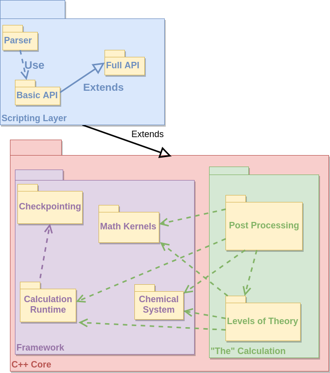

How the Code is Structured
==========================

The point of this page is to provide context on various aspects of NWChemEx's
code infrastructure.  For our purposes infrastructure covers the way the user
interacts with the code, the classes passed between discrete modules and the 
APIs of modules.  Details pertaining to how a specific module works can be 
found in that module's documentation.

Contents
--------
1. [Interactions With Users](#interactions-with-users)  
2. [NWChemEx SDK](#nwchemex-sdk)    
   a. [Calculation Runtime](#calculation-runtime)    
   b. [Checkpointing](#checkpointing)  
   c. [Chemical System](#chemical-system)  
   d. [Math Kernel](#math-kernel)  
   e. ["The" Calculation](#the-calculation)    
3. [Framework Classes](#framework-classes)  
   a. [Calculation Runtime](#calculation-runtime-classes)    
   b. [Checkpointing](#checkpointing-classes)  
   c. [Chemical System](#chemical-system-classes) 
4. [Program Flow](#program-flow)     

Interactions With Users
----------------------- 

Arguably the paramount starting point for a design of a software package is 
to understand what that package should do (broadly speaking).  Presently we 
identify four types of users:
 
1. Normal users
   - Goal: run "normal" computations 
   - Okay switching to new input syntax
2. Old users
   - Goal: run "normal" computations
   - Use old NWChem syntax
3. Power users
   - Run non-standard computations
   - Non-invasively extend functionality
4. Developers
   - Extend the functionality of NWChemEx
The following use case diagram is meant to provide more details pertaining to
the typical use cases each type of user expects.       

As illustrated by the diagram, users can transition between various roles, 
*e.g.* a developer will at some points in time be a "normal" user simply by 
nature of performing standard computational chemistry research.  In fact, we 
anticipat that the main consumers of NWChemEx are going to be users who want 
to run "normal calculations" (either through the new API or the old NWChem 
input file).  For our purposes a normal calculation is one of the following:

- Single-point energy computation
- Geometry optimization
- Thermochemistry calculation 
  - IR/Raman frequencies and intensities
  - ZPE, Enthalpy, Entropy, Free Energy
- Wavefunction property
  - Electrostatic potential
  - Charge analysis
  - Molecular orbitals
- Dynamics
- Reactions
  - Transition states
- PES
  - Potential energy surface scans       

The general use cases are meant to be exhaustive, the examples are not.  All 
of the above use cases rely at some point on a level of theory.  For our 
purposes a level of theory is simply the physical model used to describe the 
system.  Historically, level of theory is typically thought of as being an *ab 
initio* method; however, here we expand this to include molecular mechanics 
methods and possibly even coarse-grained and finite element methods.  Ideally 
one would like to be able to perform any of these basic calculations on an 
arbitrary level of theory.  Finally, being an NWChem product we especially want
the above calculations to work and perform well in highly-parallel 
environments.  

Not all computational chemistry research relies on the basic use 
cases.  Sometimes you need access to non-standard quantities (*i.e.* 
quantities not typically reported, say the Fock matrix).  This is the target 
use case for the group of users we label power users.  By nature of the more 
ambiguous use case the API will have to be lower-level to provide the 
necessary flexibility.  More generally speaking, what a power user really 
wants to do is be able to control every aspect of the computation. The final 
power user use case is the ability to pick-up on a previously run computation.
This does not mean restart it in the standard sense (*i.e.* jump back into a 
non-finished computation), but rather means using the completed computation 
as a starting point for say further property analysis.  Particularly during 
the typical computational chemistry research cycle this ability will prove 
useful, as often one realizes that they need another analysis after already 
have run some calculation. 

The last user base is developers.  We want NWChemEx to be a viable platform 
for further scientific discovery.  That is to say it should be as painless 
as possible to test a new method or algorithm.  This is facilitated by:
- Scriptable development environment
- Not having to change large portions of code to interject new code can be 
- Highly-tuned reusable components for rapid prototyping
- Adding features (or anything really) "Just Works"  

These developer use cases really amount to stating that the underlying code 
of NWChemEx should be decoupled. 

NWChemEx SDK
------------

In order to meet the use cases laid out in the previous section we purpose 
the NWChemEx SDK (software development kit).  Summarily NWChemEx SDK is 
comprised of two major components:

- Scripting layer
  - For users who are not developers
  - Contains:
    - Input mechanism for normal use cases
    - Script language bindings to C++ core
- C++ core
  - For developers
  - Implements all features used by scripting layer        

Within both the scripting layer and the C++ core there are several major 
components, which are summarized in the following package diagram.

As stated in the above summary, the scripting layer is designed to meet the 
use cases of users who are not developers.  Its key features are:

- Parser
    - Maps old NWChem syntax to new syntax
- Basic API
  - Routines for performing "normal" computations 
    - Easy to run a computation (*i.e.* many assumptions employed)
      - Requires minimal input (say XYZ, basis name, and level of theory)
      - Chooses reasonable defaults for thresholds, number of iterations, *etc.*
    - Written in terms of Full API
- Full API: 
  - Script bindings for the C++ Core
  - Fine-grained control over function calls
    - Test new workflow in "input"
    - Add new feature in "input"
    - "Rewire" NWChemEx from the "input" for advanced calculations
 
*N.B.* "input" is in quotes because the traditional view of an input file is 
gone and instead replaced with a literal script that is then run through the 
interpreter of choice (currently purposed to be Python).   

As mentioned the scripting layer is really just a means for easy access.  All
functionality available in the scripting layer stems from the C++ core, hence
it is possible to run a calculation entirely within C++ (one would write a 
main function that manually fills the classes and then runs the routines).  
For conceptual reasons we separate the C++ core into two major subcomponents:  
- Framework
  - Designed to provide the infrastructure for the "guts" of the code
  - Composed of: 
    - Calculation Runtime
      - Software representation of the environment the calculation is running in
    - Checkpointing
      - Facilitates archiving data from the calculation runtime
      - Goal is to enable recovery, restart, and full scientific logging
    - Chemical System
      - Classes and routines for manipulating the calculation's subject
      - Primary vessels for passing input information  
    - Math Kernels
      - "Provides" necessary mathematical operations
        - Likely just interface to exterior math libraries 
- "The" Calculation
  - The guts of NWChemEx
  - Implementations that actually run the requested calculation
  - Composed of:              
    - Levels of Theory
        - Physical models for describing a chemical system
    - Post processing methods
        - Does chemistry stuff (*e.g.* runs dynamics) using levels of theory

Being the interface between typical users and the C++ core, the use cases for 
the scripting layer are really those outlined in the [Interactions With 
Users](#interactions-with-users) section.  The use cases for the remaining 
components are summarized over the next several subsections.  Given that the 
goal is to have the entire C++ core's APIs accessible to the scripting layer, we
have, for simplicity, omitted showing the scripting layer as a user in the 
forthcoming use.                                

### Calculation Runtime

As mentioned, the calculation runtime is the software representation of the 
actual environment that the calculation is currently running in.  It is thus 
a sort of meta layer living above what one thinks of as "the" calculation.  
Nevertheless, the calculation runtime is an important aspect of NWChemEx as 
it will provide most of the framework's features.  The envisioned users and 
their use cases are depicted in the following use case diagram.

For conceptual clarity we divided the calculation runtime into two disjoint 
runtimes, the computer runtime and what we call the chemistry runtime.  The 
former of these two is more straightforward and consists of:

- Streams
  - Standard out, error, and debug
  - API for calling streams ensures uniformity and cleanliness
- Disk
  - File I/O is at some level inevitable, provides common API for handling it
  - Implemented by something like HDF5
- Parallel runtime
  - Fundamental mechanism for accessing inter- and intra-process parallelization
    - Inter-process likely MPI
    - Intra-process CPU: OpenMP (?)
    - Accelerators... (?)
  - Task Queue
    - Both inter-process and intra-process queues
    - Likely implemented by other library MADNESS, Kokkos,...  

The chemical runtime is perceived of having two major components:

- Calculation state
  - "Log" of information known about current chemical system
    - Very similar to RTDB (I think)
    - Key quantities to checkpoint
- Chemistry/Physics "runtime"
  - Describes the physics/chemistry the calculation is being run under
    - Fundamental constants and unit conversions
    - Basis set libraries
    - Force field parameters

### Checkpointing

One could make a reasonable argument that checkpointing is part of the 
calculation runtime.  However, historically in electronic structure theory
checkpointing is something that gets thrown to the wayside and we thus wish 
to single it out.  Our philosophy is that checkpointing is really the same as
saving your work; automatic checkpointing is then the same as autosaving.  Both
of these features are expected in the modern era of computing, where loosing 
two minutes (let alone two weeks) of work is deemed unacceptable.  
Admittedly two minutes is an unreasonable expectation for electronic 
structure theory, but the point stands.  From the get go we thus seek to 
establish checkpointing capabilities to mitigate loss of work.  Despite the 
importance of checkpointing its use case are envisioned as being 
quite simple as shown in the following use case diagram.

Checkpointing boils down to the framework needing the ability to save/load 
its state from the hardware.  Additionally this state should be complete 
enough that power users can add on to their calculation (equivalent to 
loading a saved file) based off the checkpoint file.  We anticipate basic 
computations only indirectly accessing the checkpoint capabilities via their 
calls to the runtime.

### Chemical System

The chemical system component is responsible for describing and manipulating 
the chemical system the user is interested in.  Depending on the level of 
detail there are many use cases for this component.  In an attempt to 
keep the discussion general we will discuss the use cases only at a very high
level. From this perspective, the following use case diagram shows what we 
think are the most common uses of the chemical system component.

Arguably the main use case for the chemical system is to provide details of 
the molecules of interest.  This includes details such as the positions of 
the nuclei, charges, multiplicites, *etc.*  In addition to details about the 
molecules we also need details about the space they are embedded in.  For the
most part these details amount to what (if any) fields are the molecules 
embedded in as well as the shape of the unit cell.
 

### Math Kernel

Given that NWChemEx ultimately is a collection of mathematical theories it is
no surprise that math kernels will play a central role within NWChemEx.  We 
anticipate the primary mathematical needs of NWChemEx being: 

These use cases are themselves very generic.  Briefly they can be summarized as:

- Tensors
  - Includes vectors an matrices
  - Full support for tensor algebra
  - Implemented by TAMM
- Transforms
  - At very least Fourier transform, but others as needed
- Numerical calculus
  - Finite difference
  - Numerical integration
    - DFT grids here (?)
- Math constants
  - Not Euler's number or pi, but rather Factorials, binomial coefficients,...
- Graphs
  - Useful all around computer science construct
  - Many libraries exist
- Numerical solvers
  - Should work with tensor component
  - Both intra- and inter-process variants are needed  

Despite the divisions of use cases listed here it is likely that the 
same backend may contribute to several of these use cases; this  assumption 
is particularly relevant for the tensor component. 

### "The" Calculation

Together the level of theory and any post processing done on it represent what 
is typically thought of as a quantum chemistry calculation. One could thus 
make the claim that "the" calculation is NWChemEx proper and everything else 
is the SDK and runtime.  With that said we anticipate future method 
development research to be directed almost exclusively at the component we 
are calling "the" calculation.  Furthermore, we expect every call made by a 
normal user, and almost every call made by a power user, to touch "the" 
calculation at some point.  The following use case diagram depicts the major 
uses of "the" calculation component. 

   

This diagram is interesting in that both the level of theory and the post 
processing component make appearances not only as components, but as users.  
This is to say we anticipate levels of theory calling other levels of theory 
and have made explict the fact that post processing methods will all utilize 
levels of theory in some sense.  Despite being the core of the electronic 
structure package, the use cases are relatively simple.  Summarily:

- Level of theory
  - Energy derivatives
  - Wavefunction/density
    - Likely force MM to have some concept of wavefunction for API sake
- Post processing
  - Reactions
  - Wavefunction properties
  - Dynamics
  - PES

Framework Classes
-----------------

With the enumeration of the use cases of each major component of the NWChemEx
SDK we are in a position to describe the major classes of each component.  In
particular we focus on the major aspects of the APIs.  We ignore the math 
kernel component for the time being aside from the fact that it will provide 
some form of Tensor class (which we creatively term `Tensor`).  This means 
that the bulk of the remaining classes comprising the framework will live in 
the runtime component.

### Calculation Runtime Classes 

The major classes envisioned as living inside the runtime component are shown in 
the following class diagram.

At the top of the class hierarchy (actually shown on the right of the above 
class diagram) is the `Runtime` class.  The points to note about `Runtime` are:

- Aggregates three major aspects of the computation's runtime
- Not a singleton (*i.e.* can have multiple instances)
  - Can for example make a copy that has no parallel devices and forward that
    to ensure sub functions to ensure they run serially.
 
Of the three members of the `Runtime` class, the `ChemicalRuntime` class is 
arguably the most straightforward.  Briefly:
  
- Aggregates chemical data, subclasses are:  
  - `Wikipedia`, which is a collection of fundamental constants
    - Named `Wikipedia` because that's where most people get this sort of info 
      - (Constants actually taken from credible sources)
    - Class vs. header file facilitates loading different data non-invasively
      - Useful if you want to try to match another program...
  - `BasisSetExchange` stores the defined basis sets
    - Named for EMSL basis set exchange because that's where you get basis sets 
    - Given a `Molecule` instance will apply a specific basis set
      - Would also have mechanism for applying specific basis to select atoms
    - Largely serves as a cache of loaded basis sets
      - Prevents reading from file multiple times
      - Logs basis set in case it's user defined
    - Basis sets are stored by keys (like "aug-cc-pVDZ")
      - Allows user to define their own basis and store it
- Also contains/will contain other typically looked-up data
  - Force field parameters, EFP parameters, *etc.*
    - Long term I think force fields should be defined via "recipes"
      - Basically use [this](https://github.com/ryanmrichard/ForceManII) MM lib.
  - Facilitates user defined versions and logging of said versions
  
From the high-performance computing perspective the `ParallelRuntime` class 
is one of the most important classes and is how the other components of 
NWChemEx will interact with the parallel runtime (the idea for "devices" is 
stolen from TensorFlow if we're being honest...).  The main summary points:

- `ParallelRuntime` holds available devices
  - Possible to pull a device if it's full
    - There's also merit for letting people queue up on it too...
- Idea is to work off futures to facilitate asynchronous computation    
- Each "device" is an abstraction of where the code will run
  - Want to run on a GPU? Grab the GPUDevice
- For task-based, shared memory parallelism only need a task queue, a "parallel
  for", and a "parallel reduce" (philosophy of many libraries at least)
  - For distributed also need to move memory
  - Likely to be a thin wrapper

The final component of `Runtime` is `CalculationState`.  Of the three 
components this is likely the least straightforward.  Its purpose is two-fold
to decrease coupling among components and to serve as the mechanism for 
logging the calculation's state.  Exactly how this all goes down is outlined 
below in the section [XXX](#link-to-section); for now, we present a summary 
of its features:

- Contains a record of results
  - Map between conditions under which result was generated and said result
  - Serves as a cache for avoiding unnecessary recomputation
  - Serves as log for later data analysis
  - Jumping off point for loading a previous calculation
  - Guts of what needs checkpointed
- Contains the list of available modules
  - Facilitates logging what version of a module was used *etc.*
  - Allows modules to remain uncoupled till runtime
  - Mechanism for user generated modules
    - Rapid prototyping
    - Power-user access point
- Contains list of user set (and defaulted) options
  - Options are stored per module
    - Allows two instances of a module with different options
      - Useful for turning on say DIIS after a set condition
  - Options are key associated
    - At moment using strings, but could be enums
      - Strings allow new options to be added without updating enum
      - Enums less error prone
  - Arbitrary types (*i.e.* more than integers and/or doubles)
  
### Checkpointing Classes        

To be written by Kris.

### Chemical System Classes

Given that the central point of NWChemEx is to compute the properties of 
chemical systems, it is no surprise that the chemical system is a rather 
complex entity.  The following class diagram shows the major players in the 
chemical system component.

Superficially the `ChemicalSystemClass` represents the top-level class of the
component.  It is comprised of instances of three sub-classes:

- Molecule
  - Describes the atoms of the system
- UnitCell
  - Describes the space the system lives in
- Field
  - Describes the fields applied to the system
  
Of the three classes, the `Field` class is the simplest.  At its core the 
`Field` class is an abstract base class from which the actual fields will 
derive.  Its major member function is `deriv`, which computes a given 
derivative of the field at a series of points in space (the input `Tensor` 
object represents a batch of points to evaluate the field at).  `UnitCell` is 
the next simplest of the three classes.  It's primary responsibility is to 
describe the symmetry of the space the molecule is embedded in (specifically 
describe the non-repeating unit of space).  For several purposes we will also
need the ability to form super cells (the union of multiple `UnitCell` 
instances).  As the class hierarchy stands there's nothing stopping the 
`UnitCell` class from having multiple `UnitCells` inside it (aside from the 
name)/

TODO: Change `UnitCell` to `CrystalCell` ???

Side note.  To some extent the only reason we need the atoms and molecule 
class is to define the field generated by the nuclei.  If we fully embraced 
the nuclei as a field could we get away with only an electronic wavefunction 
class for describing our system.  To some extent this leads to the implication 
that a nuclear wavefunction class could be used to treat the nuclei quantum 
mechanically simply by dropping the field that they generated (*i.e.* by 
removing the idea of a "molecule" it facilitates going beyond the clamped 
nuclei approximation).

The remaining sub-class of the `ChemicalSystem` class is the `Molecule` class.
For most of NWChemEx this will be the class of most interest.  At the moment 
`Molecule` serves as a glorified ordered set of `Atom` instances.  Aside from
details pertaining to the charge and multiplicity of the molecule the primary
usage of the class will be to get the basis set.  This is where the diagram 
gets a bit complicated.  Each `Atom` instance holds its basis functions 
(although non-canonical, if you think about it, the basis functions are the 
descriptions of the electrons on the atom, which justifies their existence 
here).  Regardless of philosophical reasonings, many codes have problems 
keeping the basis set and the atoms synchronized because they insist on 
keeping them separate.  By keeping the basis functions with their centers we 
ensure that they stay synchronized (this also makes it very easy to get other
properties right, like symmetry, that depend on the description of two atoms
being exactly the same). The `BasisShell` class is presently assumed to be 
Gaussian-like; however, in theory it could be adapted to hold other types of 
atom-centered basis functions.  Aside from the basis functions the `Atom` 
class also contains more traditional members like the nuclear charge and 
atomic symbol.

Auxiliary to the `Molecule` class are the `SystemFragmenter` and the 
`Topology` classes.  Of the two the latter is the easier to explain.  Given a
`Molecule` instance the `Topology` class populates itself with all the 
bonds, angles,...(generally speaking "internal coordinates") that can be 
formed from the atoms (this relies on a definition of connectivity, the 
origins of which are at the moment ignored).  Each of these coordinates is 
stored in a class that is capable of computing derivatives of its value.  The
`SystemFragmenter` is a somewhat novel concept and represents a 
generalization of the many ways one can chop up a system.  From the 
perspective of the `ChemicalSystem` class, the only thing that matters is 
that the `SystemFragmenter` class takes one `ChemicalSystem` instance and 
splits it into multiple, possibly non-disjoint, sub `ChemicalSystem` 
instances.  Associated with each instance is a weight to be used when 
recombining the sub systems (in all use cases imagined the point of 
fragmenting the system is to get at the supersystem's properties more 
economically; this requires being able to put the subsystem's properties back
together).  The information related to how the `ChemicalSystem` was split is 
collected in the `FragmentedSystem` class.  It should be noted that QM/MM 
would be a `FramentedSystem` instance containing two subsystems (the QM and the 
MM regions). 

Before moving on it is worth addressing a few other points.  From the 
perspective of the `ChemicalSystem` component things like distinction between
QM and MM are handled by having one `Molecule` instance be the QM "molecule"
and another instance be the MM "molecule".  Symmetry is thought to be a 
measurement on a system, *i.e.* one would pass a `ChemicalSystem` instance to
a function or class that would then compute its symmetry.  Determining the 
symmetry of a geometrical object is a general thing and should thus be 
packaged in a reusable manner. 
   

Program Flow
------------

Based on the previous sections a natural program-flow is given by:

We foresee two entry points into a run (*i.e.* any use case designed at 
obtaining chemical results):

1. Simple API
   - Only accessible via scripting API
   - Automatically calls the routines shown in the Full API flow column
   - Responsible for reporting results to user
     - If checkpointed, can be restarted via Full API to get other results 
2. Full API
   - Executed as a script if in the scripting layer
   - Hard coded into a `main` function if only using C++ runtime
   - User is responsible for printing desired results
      
Regardless of which entry point is used program flow proceeds according to:
1. Runtime is started
   - `MPI_Init`, `omp_get_max_threads()`, *etc.*
2. An initial chemical system instance is created
   - This need not be just "XYZ" to molecule, can be entire algorithm
   - Will typically be a single class
     - Most "multi-system" calculations are approximations to a single system
       - Fragment based, QM/MM, embedding methods: target is supersystem
     - For geometry optimizations/PES scans starting geometry
     - System generation is considered part of the calculation and done there            
   - Multiple instances sometimes *e.g.* transition state searches
   - Application of basis handled here
     - Ghost functions would be applied as part of calculation
3. An initial wavefunction is created
   - Do we ever need more than 1 wavefunction initially?
     - Multi-reference is multi-determinant, not multi-wavefunction
     - Excited state methods generate multiple wavefunctions as output
       - Use as generator for dynamics
   - Formally, even MM has a wavefunction       
4. Next we load the initial chemical runtime state
   - If this is a restart it comes from the checkpoint file
   - Else start with an empty one
   - Valid, trivially restartable state is key to using Jupyter notebooks
5. Run requested computation
   - The loop allows for multiple jobs to be in an input file
     - Directly using runtime allows parallelization of jobs here, but...
   - Computation maps to "do a parameter scan" not "run bond length 1.24"       
     - Coarse-grained parallelism within these commands
6. If desired, save the chemical runtime's state (presumably to disk)      
7. Shut down the runtime
   - `MPI_Finalize`, *etc.*
8. If this was simple input, return a simple output
   - Full API can literally do anything, up to user to log what they wanted
   - Simple output: literally print and **return** requested data
     - Printing for the user avoids problem of user running 2 week coupled 
       cluster, trashing checkpoint, and forgetting to print result...
     - Returning the requested quantity avoids users having to parse outputs 
       - Direct return allows for direct usage
   - Traditional output is little more than debug logs, avoid it
     - Saw it somewhere in the Google drive notes and liked this sentiment   
                              
    
Throughout the above description take note of the forced uniformity, *i.e.* 
"one system", "one wavefunction", *etc.* This makes it easier to define common 
interfaces for disparate things like QM/MM and coupled-cluster and to 
automate as much as possible.  The overall design goal is to branch at the last
possible second.

