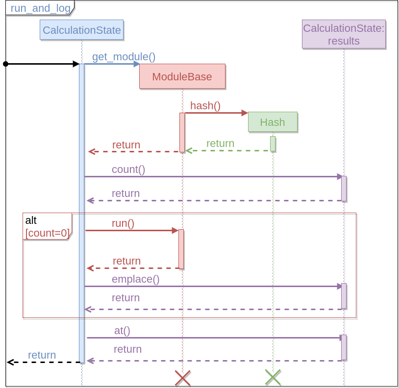
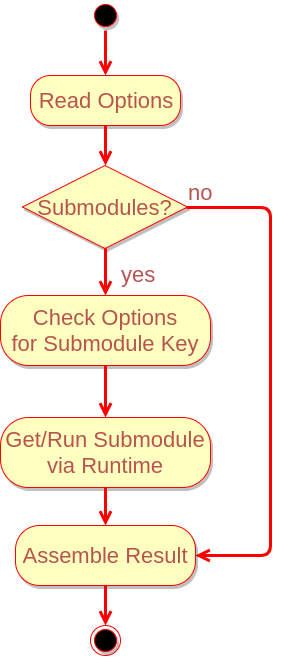
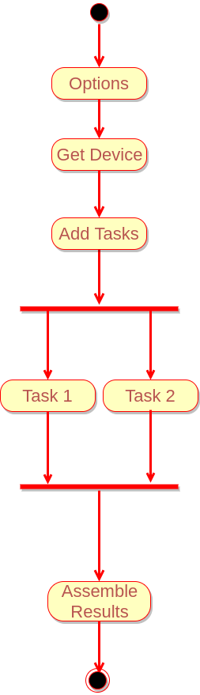

Program Flow
============

The point of this section is to describe the flow of NWChemEx at various 
points during execution and at various levels of detail.  

Contents
--------
1. [Overall Flow](#overall-flow)
2. [Running "The" Calculation](#running-the-calculation)
3. [Module Workflows](#typical-module-workflow)

Overall Flow
------------

Based on the layout of the packages within NWChemEx a natural flow for the 
program is:

We foresee two entry points into a run (*i.e.* any use case designed at 
obtaining chemical results):

1. Basic API
   - Only accessible via scripting API
   - Automatically calls the routines shown in the Full API flow column
   - Responsible for reporting results to user
     - If checkpointed, can be restarted via Full API to get other results 
2. Full API
   - Executed as a script if in the scripting layer
   - Hard coded into a `main` function if only using C++ runtime
   - User is responsible for printing desired results
      
Regardless of which entry point is used program flow proceeds according to:
1. Runtime is started
   - Parallel-wise: `MPI_Init`, `omp_get_max_threads()`, *etc.*
   - Chemical-wise: Load selected basis set, atomic constants, *etc.*
   - Calculation-wise: Modules to be used, default options, *etc.*
2. An initial chemical system instance is created
   - This need not be just "XYZ" to molecule, can be entire algorithm
     - Algorithm examples: symmetrizing molecule, replicating, *etc.* 
   - System will be a single instance (typically)
     - Most "multi-system" calculations are approximations to a single system
       - Fragment based, QM/MM, embedding methods: target is supersystem
     - For geometry optimizations/PES scans starting geometry
     - System generation is considered part of the calculation and done there            
     - Multiple instances sometimes *e.g.* transition state searches
   - Application of basis handled here
     - Ghost functions would be applied as part of calculation
   - Wavefunction is part of chemical system
     - Do we ever need more than 1 wavefunction initially?
     - Multi-reference is multi-determinant, not multi-wavefunction
     - Excited state methods generate multiple wavefunctions as output
       - Use as generator for dynamics
     - Formally, even MM has a wavefunction       
3. Load the initial chemical state
   - If this is a restart it comes from the checkpoint file
   - Else start with an empty one
   - Valid, trivially restartable state is key to using Jupyter notebooks
5. Run requested computation
   - The loop allows for multiple jobs to be in an input file
     - Directly using runtime allows parallelization of jobs here, but...
   - Computation maps to "do a parameter scan" not "run bond length 1.24"       
     - Coarse-grained parallelism within these commands
6. If desired, save the calculation's state (presumably to disk)      
7. Shut down the runtime
   - `MPI_Finalize`, *etc.*
8. If this was simple input, return a simple output
   - Full API can literally do anything, up to user to log what they wanted
   - Simple output: literally print and **return** requested data
     - Printing for the user avoids problem of user running 2 week coupled 
       cluster, trashing checkpoint, and forgetting to print result...
     - Returning the requested quantity avoids users having to parse outputs 
       - Direct return allows for direct usage
   - Traditional output is little more than debug logs, avoid it
     - Saw it somewhere in the Google drive notes and liked this sentiment   
                              
    
Throughout the above description take note of the forced uniformity, *i.e.* 
"one system", "one wavefunction", *etc.* This makes it easier to define common 
interfaces for disparate things like QM/MM and coupled-cluster and to 
automate as much as possible.  The overall design goal is to branch at the last
possible second.

Running "The" Calculation
-------------------------

In this section we take a look at the process of running a calculation (or 
more generally speaking running a module).  There are two ways to run a module:

1. Via `run_and_log` member function of `CalculationState`
2. Directly calling `run` on the result of `get_module`

They differ in that the first option will automatically log the result (think
of it as the equivalent of the user running the module and then hitting save 
afterwards), whereas the second option will not save the result.  `run_and_log` 
is thus best thought of as a wrapper around scenario 2.  For this reason this is
the preferred mechanism for running a module; however, we ultimately leave the 
choice of how to call a submodule up to the writer of the module.  The following
sequence diagram shows the steps that occur within a `CalculationState` instance
when a user calls the `run_and_log` member function.

1. The `CalculationState` builds a new instance of the requested module
2. Arguments to `run_and_log` are forwarded to the module's `hash` function.
   - The hash is assumed unique for each unique input
     - In practice requires combining the hashes of
       1. The input arguments 
       2. Relevant options
       3. All submodules
       4. (possibly) the module info (*i.e.* version info)
3. A check is made to see if we already have the result
   - If it we don't, we compute and save it
4. The result is returned   

This mechanism keeps a dynamic record of a computation's state, using 
pre-cached data when available to speed up computation.  Furthermore, by 
pre-loading the cache with the answers, calls amount to little more than a 
pointer dereference (*i.e.* are basically free).  As written this call does 
not save the computation's state.  At least initially, the idea is that the 
user of `CalculationState` will save the contents manually.  The next step is
to make the `results` member an intelligent class that is capable of 
automatically saving itself to disk.  Long-term the intent is that this class
becomes more sophisticated by also gaining the ability to automatically free up
memory (*i.e.* via some yet to be derived mechanism it would know that 
certain results can be deleted; whereas other results cannot, but can be moved 
to disk).  Finally, note that if one is parallelizing over the calls to 
`run_or_log` the instances on each process will differ.

Module Workflows
----------------

The previous sections have focused on workflows that occur largely within the
framework.  This section turns our attention to "typical" workflows within 
modules.  As modules represent the guts of what it means to do computational 
chemistry this overview will necessarily be general as it is impractical to 
go into detail given that module use cases range from separating the QM and MM 
regions of a system, to running coupled-cluster.  That said, broadly speaking
the majority of modules will follow a conceptual workflow similar to the 
following activity diagram.

 

Upon control entering your module via its `run` function the first thing most
modules will do is read in the various knobs that are associated with it (*i.e.*
figure out the number of iterations, screening thresholds, *etc.*).  This 
information is passed to your module upon its construction and lives in a 
base class common to all module types.  The next task will be to figure out 
what submodules you are calling (if you like you can think of this as  
figuring out what is the name of the function that will, say, build the 
Fock matrix for me; as opposed to just assuming you know it, *i.e.* hard 
coding the function's name).  This is done by getting their keys from your 
options instance and then calling the corresponding module via the runtime 
instance also found in your base class (if you call the submodule via 
`run_and_log` then upon completion you will be able to restart from that 
call).  Finally, with all the submodule calls out of the way you are able to 
assemble the quantity or quantities that your module is responsible for and 
return it.  Note that it's not your responsibility to save your results, 
rather that falls on the caller of your module.  Specifically, if they called 
you via `run_and_log` your results will be saved (like it or not they are the 
module in a better position to determine if your results warrant saving).

TODO: What happens when A calls B directly and B calls C via `run_and_log` ? 
As it sits the results of C are saved, despite A not wanting to save B's 
results.  Is that the best option?  

Given the central role of parallelism in NWChemEx the next workflow shows how
the typical workflow is modified to allow for coarse-grained parallelism.

After the initial collecting of options, the module secures a device on which
to run the computations.  Since this is a coarse-grained run it is sufficient
to provide the device a series of functions to run.  In terms of something 
like a finite-difference computation this could be as simple as adding the 
submodules to run to the queue.  After the tasks are added your computation 
is free to carry on and do other work (the task queues operate asynchronously).
At some point the queued tasks finish and you can collect the results into a
format suitable for returning.  As you'll note this workflow naturally 
accounts for task dependencies (that is a submodule's tasks are dependencies of 
its parent's tasks).  Finally, workflows for fine-grained parallelism are 
similar; the major difference is your algorithm will be responsible for 
directly using the devices. 
