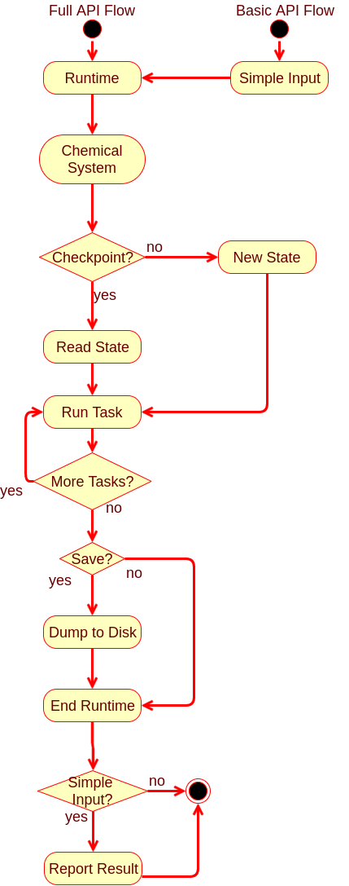

Program Flow
============

The point of this section is to describe the flow of NWChemEx at various 
points during execution and at various levels of detail.  

Overall Flow
------------

Based on the layout of the packages within NWChemEx a natural flow for the 
program is:

We foresee two entry points into a run (*i.e.* any use case designed at 
obtaining chemical results):

1. Basic API
   - Only accessible via scripting API
   - Automatically calls the routines shown in the Full API flow column
   - Responsible for reporting results to user
     - If checkpointed, can be restarted via Full API to get other results 
2. Full API
   - Executed as a script if in the scripting layer
   - Hard coded into a `main` function if only using C++ runtime
   - User is responsible for printing desired results
      
Regardless of which entry point is used program flow proceeds according to:
1. Runtime is started
   - Parallel-wise: `MPI_Init`, `omp_get_max_threads()`, *etc.*
   - Chemical-wise: Load selected basis set, atomic constants, *etc.*
   - Calculation-wise: Modules to be used, default options, *etc.*
2. An initial chemical system instance is created
   - This need not be just "XYZ" to molecule, can be entire algorithm
     - Algorithm examples: symmetrizing molecule, replicating, *etc.* 
   - System will be a single instance (typically)
     - Most "multi-system" calculations are approximations to a single system
       - Fragment based, QM/MM, embedding methods: target is supersystem
     - For geometry optimizations/PES scans starting geometry
     - System generation is considered part of the calculation and done there            
     - Multiple instances sometimes *e.g.* transition state searches
   - Application of basis handled here
     - Ghost functions would be applied as part of calculation
   - Wavefunction is part of chemical system
     - Do we ever need more than 1 wavefunction initially?
     - Multi-reference is multi-determinant, not multi-wavefunction
     - Excited state methods generate multiple wavefunctions as output
       - Use as generator for dynamics
     - Formally, even MM has a wavefunction       
3. Load the initial chemical state
   - If this is a restart it comes from the checkpoint file
   - Else start with an empty one
   - Valid, trivially restartable state is key to using Jupyter notebooks
5. Run requested computation
   - The loop allows for multiple jobs to be in an input file
     - Directly using runtime allows parallelization of jobs here, but...
   - Computation maps to "do a parameter scan" not "run bond length 1.24"       
     - Coarse-grained parallelism within these commands
6. If desired, save the calculation's state (presumably to disk)      
7. Shut down the runtime
   - `MPI_Finalize`, *etc.*
8. If this was simple input, return a simple output
   - Full API can literally do anything, up to user to log what they wanted
   - Simple output: literally print and **return** requested data
     - Printing for the user avoids problem of user running 2 week coupled 
       cluster, trashing checkpoint, and forgetting to print result...
     - Returning the requested quantity avoids users having to parse outputs 
       - Direct return allows for direct usage
   - Traditional output is little more than debug logs, avoid it
     - Saw it somewhere in the Google drive notes and liked this sentiment   
                              
    
Throughout the above description take note of the forced uniformity, *i.e.* 
"one system", "one wavefunction", *etc.* This makes it easier to define common 
interfaces for disparate things like QM/MM and coupled-cluster and to 
automate as much as possible.  The overall design goal is to branch at the last
possible second.

Running "The" Calculation
-------------------------

In this section we take a look at the process of running a calculation (or 
more generally speaking running a module).  There are two ways to run a module:

1. Via `run_and_log` member function of `CalculationState`
2. Directly calling `run` on the result of `get_module`

They differ in that the first option will automatically log the result (think
of it as the equivalent of the user running the module and then hitting save 
afterwards), whereas the second option will not save the result.  One can 
think of the first option as a wrapper around the second.  To that end, the 
following diagram details the sequence of events that happens when one calls 
the `get_module` member function of `CalculationState`.

As shown the sequence is pretty simple, but there are two things worth 
pointing out.  First, we need to violate RAII because of C++'s rules on using
virtual functions in a constructor (if you like `CalculationState` is a 
factory for generating modules).  To this end the actual initialization is 
done via the member function `initialize`.  The second point to note is that 
the resulting module instance is new.  Reuse of the internal buffers of a 
module happens by repeatedly calling its `run` function.

As mentioned, use of `run_and_log` is a wrapper around `get_module`, followed
by `run` that logs the result.  For this reason this is the preferred mechanism
for running a module 
calling modules via the first option is preferred, but we ultimately leave that
choice up to the writer of the module.  The following sequence diagram shows the
steps that occur within a `CalculationState` instance when a user calls the
`run_and_log` member function.

- (Steps 1-3) The `CalculationState` instance will forward its arguments to the 
  requested module, which in turn will return a hash.
  - The hash should be unique with a collision if and only if two invocations of
    a module are guaranteed to return the same result.
    - In practice requires combining the hashes of
      1. The input arguments 
      2. Relevant options
      3. All submodules
- The `CalculationState` instance then checks to see if the hash is for a
  previously computed quantity
  - If it is, the result is returned (first alt case Steps 4-5)
  - If not:
    - The result is computed (second alt case Steps 4-5)
    - The result is stored under the hash (second alt case Step 6)
    - The result is returned (second alt case Step 7)

To directly run a computation one obtains the requested module from 
`CalcaultionState` and then calls `run` on it.
